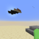

# valed (valed.gg) World Save - Snapshot Details

- **Time**: `Tue, 3 Dec 2024 21:09:35 +0700` (Timestamp: `1733234975700`)
- **Captured By**: `BlueBVN1716`

## Server
- **IP**: `valed.gg`
- **Capacity**: `18/269`
- **Brand**: `Pufferfish (Velocity)`
- **MOTD**: `                   VALED  1.12-1.21               Minecraft made competitive`
- **Version**: `Velocity 1.7.2-1.21`
- **Protocol Version**: `765`
- **Server Type**: `OTHER`

## Connection
- **Host Name**: `89.33.12.185`
- **Port**: `25565`
- **Session ID**: `ada710a7-04ba-4b12-b2e3-eca4c09835ea`

This file was created by [WorldTools 1.2.4](https://github.com/Avanatiker/WorldTools/)
